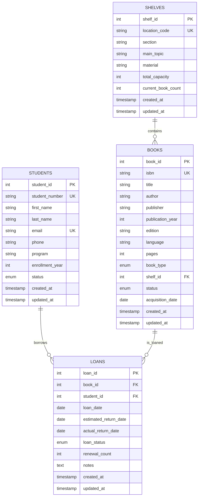

# Library Management System Database Design

## Overview

This design document outlines the database architecture for a library management system that supports book inventory management, student loan tracking, and shelf organization. The design follows relational database principles with proper normalization to ensure data integrity, scalability, and efficient querying capabilities.

The system is designed to handle the core library operations while maintaining flexibility for future enhancements such as digital book management, multiple patron types, and configurable loan policies.

## Architecture

### Database Management System

- **Database**: PostgreSQL
- **Design Principles**:
  - Third Normal Form (3NF) normalization
  - ACID compliance for transaction integrity
  - Referential integrity through foreign key constraints
  - Optimized indexing for common query patterns

### Core Design Patterns

- **Entity-Relationship Model**: Clear separation of concerns with well-defined entities
- **Audit Trail**: Comprehensive logging of all database changes
- **Business Logic Triggers**: Automatic shelf capacity and loan status management
- **Repository Pattern**: Clean data access layer with CRUD operations

## Components and Interfaces

### Core Entities

#### 1. Student Entity

```sql
Students Table:
- student_id (Primary Key, Auto-increment)
- student_number (Unique, VARCHAR(20))
- first_name (VARCHAR(100), NOT NULL)
- last_name (VARCHAR(100), NOT NULL)
- email (VARCHAR(255), UNIQUE, NOT NULL)
- phone (VARCHAR(20))
- program (VARCHAR(100))
- enrollment_year (INTEGER)
- status (ENUM: 'active', 'inactive', 'graduated')
- created_at (TIMESTAMP)
- updated_at (TIMESTAMP)
```

#### 2. Shelf Entity

```sql
Shelves Table:
- shelf_id (Primary Key, Auto-increment)
- location_code (VARCHAR(10), UNIQUE, NOT NULL) -- e.g., 'A1', 'B2', 'C3'
- section (VARCHAR(50), NOT NULL) -- e.g., 'Section A', 'Section B'
- main_topic (VARCHAR(100), NOT NULL) -- e.g., 'Economics', 'Science'
- material (VARCHAR(50)) -- e.g., 'Wood', 'Metal', 'Plastic'
- total_capacity (INTEGER, NOT NULL)
- current_book_count (INTEGER, DEFAULT 0)
- created_at (TIMESTAMP)
- updated_at (TIMESTAMP)
```

#### 3. Book Entity

```sql
Books Table:
- book_id (Primary Key, Auto-increment)
- isbn (VARCHAR(20), UNIQUE)
- title (VARCHAR(500), NOT NULL)
- author (VARCHAR(300), NOT NULL)
- publisher (VARCHAR(200))
- publication_year (INTEGER)
- edition (VARCHAR(50))
- language (VARCHAR(50), DEFAULT 'Spanish')
- pages (INTEGER)
- book_type (ENUM: 'physical', 'digital', DEFAULT 'physical')
- shelf_id (Foreign Key to Shelves)
- status (ENUM: 'available', 'loaned', 'maintenance', 'lost')
- acquisition_date (DATE)
- created_at (TIMESTAMP)
- updated_at (TIMESTAMP)
```

#### 4. Loan Entity

```sql
Loans Table:
- loan_id (Primary Key, Auto-increment)
- book_id (Foreign Key to Books, NOT NULL)
- student_id (Foreign Key to Students, NOT NULL)
- loan_date (DATE, NOT NULL, DEFAULT CURRENT_DATE)
- estimated_return_date (DATE, NOT NULL)
- actual_return_date (DATE, NULL)
- loan_status (ENUM: 'active', 'returned', 'overdue', 'lost')
- renewal_count (INTEGER, DEFAULT 0)
- notes (TEXT)
- created_at (TIMESTAMP)
- updated_at (TIMESTAMP)
```

### Key Relationships

1. **Student ↔ Loan**: One-to-Many (A student can have multiple loans)
2. **Book ↔ Loan**: One-to-Many (A book can have multiple loan records over time)
3. **Shelf ↔ Book**: One-to-Many (A shelf can hold multiple books)

### Business Logic Features

- **Automatic Shelf Capacity Management**: Triggers prevent overbooking and update counts
- **Loan Status Synchronization**: Book status automatically updates with loan changes
- **Overdue Detection**: Automatic identification and status updates for overdue loans
- **Data Validation**: Comprehensive constraints for data integrity

## Data Models

### Entity Relationship Diagram (Mermaid)



### Key Constraints and Business Rules

1. **Shelf Capacity**: Automatic enforcement prevents exceeding shelf capacity
2. **Active Loans**: Only one active loan per book at any time
3. **Student Limits**: Maximum 5 active loans per student (configurable)
4. **Return Dates**: actual_return_date must be >= loan_date when not null
5. **ISBN Uniqueness**: Each ISBN can appear only once in the system
6. **Shelf Location**: location_code follows format: Letter + 1-2 digits (e.g., A1, B12)
7. **Automatic Status Updates**: Book and loan statuses sync automatically
8. **Overdue Management**: Loans automatically marked overdue when past due date

## Error Handling

### Data Integrity Constraints

1. **Foreign Key Violations**

   - Handle attempts to assign books to non-existent shelves
   - Prevent deletion of students with active loans
   - Cascade updates for shelf relocations

2. **Business Rule Violations**

   - Shelf capacity exceeded: Return error with current capacity status
   - Duplicate active loans: Prevent multiple active loans for the same book
   - Invalid return dates: Validate actual_return_date >= loan_date

3. **Data Validation**
   - ISBN format validation using check constraints
   - Email format validation for student records
   - Date range validation for loan periods

### Exception Handling Strategies

```sql
-- Shelf capacity enforcement trigger
CREATE OR REPLACE FUNCTION enforce_shelf_capacity()
RETURNS TRIGGER AS $$
BEGIN
    IF (SELECT current_book_count FROM shelves WHERE shelf_id = NEW.shelf_id) >= 
       (SELECT total_capacity FROM shelves WHERE shelf_id = NEW.shelf_id) THEN
        RAISE EXCEPTION 'Shelf % is at full capacity', NEW.shelf_id;
    END IF;
    RETURN NEW;
END;
$$ LANGUAGE plpgsql;

-- Loan business rules constraint
ALTER TABLE loans ADD CONSTRAINT check_return_date
CHECK (actual_return_date IS NULL OR actual_return_date >= loan_date);
```

## Testing Strategy

### Unit Testing

1. **Entity Validation Tests**

   - Test all constraint validations
   - Verify foreign key relationships
   - Validate enum value restrictions

2. **Business Logic Tests**
   - Shelf capacity enforcement
   - Loan status transitions
   - Overdue loan identification

### Integration Testing

1. **Transaction Testing**

   - Book loan process (multi-table updates)
   - Book return process (status updates)
   - Shelf reorganization scenarios

2. **Performance Testing**
   - Query performance with large datasets
   - Index effectiveness validation
   - Concurrent access scenarios

### Repository Testing

1. **CRUD Operations**
   - Test all repository methods (Create, Read, Update, Delete)
   - Validate search and filtering functionality
   - Verify error handling for invalid operations

2. **Data Integrity**
   - Test referential integrity enforcement
   - Validate constraint violations are properly handled
   - Verify trigger functionality for business logic

### Sample Test Queries

```sql
-- Test 1: Verify shelf capacity constraint
INSERT INTO books (title, author, shelf_id)
SELECT 'Test Book', 'Test Author', 1
FROM generate_series(1, 100); -- Should fail if shelf capacity < 100

-- Test 2: Verify loan business rules
INSERT INTO loans (book_id, student_id, loan_date, estimated_return_date, actual_return_date)
VALUES (1, 1, '2024-01-01', '2024-01-15', '2023-12-31'); -- Should fail

-- Test 3: Performance test for overdue loans
SELECT l.loan_id, b.title, s.first_name, s.last_name
FROM loans l
JOIN books b ON l.book_id = b.book_id
JOIN students s ON l.student_id = s.student_id
WHERE l.actual_return_date IS NULL
  AND l.estimated_return_date < CURRENT_DATE;
```

This design provides a robust PostgreSQL-based foundation for the library management system with automatic business logic enforcement, comprehensive data validation, and a clean repository-based data access layer.
